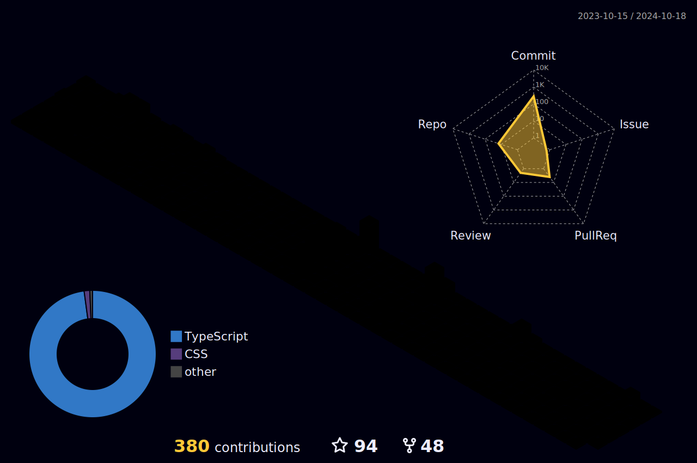

  
  

  
 |  |  |  
 | ----------- | ----------- |

 
  

   

  

 
##
   

     
  

  
 

  <a href="https://github.com/Wdenberg">
  
  

 
  
  
  
  
  
  
    

  
  ##
 

 
  
  
 	
  
   
 
 
 

